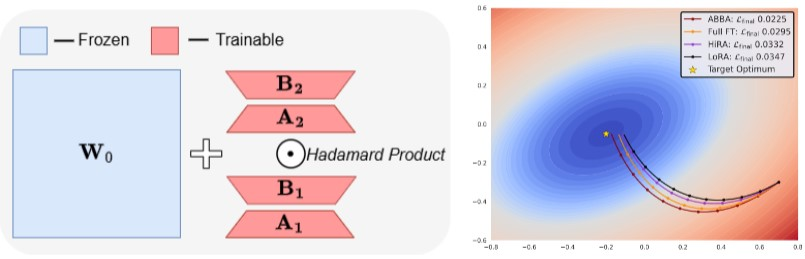

# ABBA: Highly Expressive Hadamard Product Adaptation for Large Language Models

## Introduction
Large Language Models have demonstrated strong performance across a wide range of tasks, but adapting them efficiently to new domains remains a key challenge. Parameter-Efficient Fine-Tuning (PEFT) methods address this by introducing lightweight, trainable modules while keeping most pre-trained weights fixed. The prevailing approach, LoRA, models updates using a low-rank decomposition, but its expressivity is inherently constrained by the rank. Recent methods like HiRA aim to increase expressivity by incorporating a Hadamard product with the frozen weights, but still rely on the structure of the pre-trained model.
We introduce **ABBA**, a new PEFT architecture that reparameterizes the update as a Hadamard product of two independently learnable low-rank matrices. In contrast to prior work, ABBA fully decouples the update from the pre-trained weights, enabling both components to be optimized freely. This leads to significantly higher expressivity under the same parameter budget. We formally analyze ABBA’s expressive capacity and validate its advantages through matrix reconstruction experiments. 
Empirically, ABBA achieves state-of-the-art results on arithmetic and commonsense reasoning benchmarks, consistently outperforming existing PEFT methods by a significant margin across multiple models.




## Environment

We recommend using a Conda environment to run the Python scripts for this project. Follow these commands to set up the environment and install the required libraries:

```bash
conda create -n abba python=3.10
conda activate abba
pip install -r requirements.txt
```

## Arithmetic Reasoning

To train the models, execute:

```bash
bash scripts/train_arithmetic.sh
```

This script will fine-tune a model on the MetaMathQA dataset. You can modify the `model` parameter to use a different model if desired. The script will save the fine-tuned adapters.

Run the following to evaluate on GSM8K and MATH benchmarks:
```bash
bash scripts/arithmetic_merge_eval.sh
```

## Commonsense Reasoning

To run the commonsense experiments, start by downloading the required datasets.

Begin by fetching the fine-tuning dataset available [here](XXXX). Place this file in the `data/commonsense` folder.

Next, for the evaluation phase, download the necessary datasets from [this link](XXXX). Ensure each dataset is saved in its appropriate subdirectory within `data/commonsense`.

To train the models, use:

```bash
bash scripts/train_cr.sh
```

This script will fine-tune a model on the Commonsense170K dataset. You can modify the `model` parameter to explore various models. The script will save the fine-tuned adapters.

Run the following to evaluate on commonsense reasoning benchmarks:
```bash
bash scripts/cr_merge_eval.sh
```